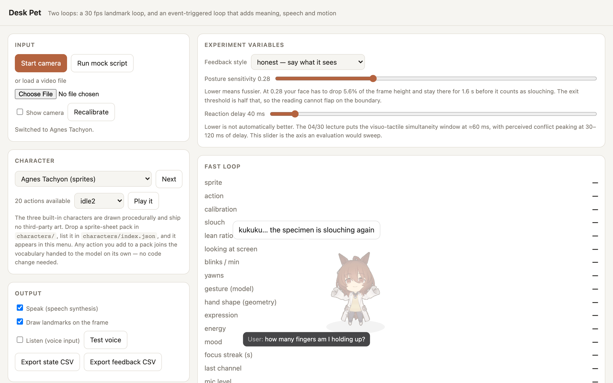

# Deskpet — an anime desk companion with two clocks



A desk pet that lives on your screen, watches you through the webcam, listens through the
microphone, and answers in character. A personal project, built because I wanted it to
exist — technology faithful to one's own desires.

The default character is Agnes Tachyon (Umamusume). She treats you as her favourite test
subject: your posture, blink rate and fatigue are her experimental data.

## What it does

- **Watches** (30 fps, fully on-device): MediaPipe face + hand landmarks → posture against a
  calibrated baseline, blink rate, yawns, expressions, per-finger states, waves and flicks.
- **Listens** (on-device ASR): streaming partial results arrive in ~7–39 ms — fast enough to
  be commands. Live captions appear under the character as you speak.
- **Speaks and moves — but only when the model says so.** Everything the puppet does arrives
  as a small verb script (`mood happy; emote wave; say ...`) written by an LLM role-playing
  the character, validated by a strict whitelisting parser. No canned lines.
- **Speaks rarely, on purpose.** A novelty gate reacts to states that are *unusual for you*
  (sliding windows per channel) plus a hard budget of 4 unprompted remarks per 10 minutes.
- **Looks when asked.** "How many fingers am I holding up?" → the model replies `snap`, the
  harness re-sends the question with a fresh annotated camera frame, and it answers from
  what it actually sees.
- **Gets shooed around.** Flick an open palm up/down/left/right and the character runs a
  quarter-screen that way (with return-stroke suppression so the recovery of your flick
  doesn't send her straight back).

Nothing in the model's vocabulary can touch the OS: the parser has no verb that clicks,
scrolls or types, so a model mistake cannot operate your machine.

## Requirements

- macOS 26+ on Apple Silicon (voice input uses the OS's on-device `SpeechAnalyzer`;
  everything except voice also works elsewhere)
- Node.js 20+
- Xcode Command Line Tools (`xcode-select --install`) for the voice sidecar
- A Chromium-based browser for the web UI
- LLM API

## Install

```sh
git clone https://github.com/AuroraRyan0301/Deskpet.git
cd Deskpet
npm install

# 1) Build the voice sidecar (microphone -> streaming transcripts)
./native/build.sh

# 2) Configure the model endpoint
cp config.local.example.json config.local.json
#    Edit config.local.json: endpoint, model, apiKey.
#    Anthropic-style (/v1/messages) and OpenAI-style (/v1/chat/completions) both work;
#    a local gateway or local vLLM/llama.cpp endpoint keeps everything on your machine.

# 3) Import character sprites (not shipped in this repo — they are fan-made assets)
git clone https://github.com/Kritzkingvoid/Desktop_Gremlin /tmp/dg
node tools/import-gremlin.mjs /tmp/dg/SpriteSheet/Gremlins/<Name> <pack-id>
#    Repeat per character; packs land in characters/ and appear in the UI dropdown.
#    Without any packs the three built-in procedural characters still work.
```

## Run

```sh
npm run serve        # web UI at http://127.0.0.1:8765
npm run pet          # Electron desktop pet (transparent, always-on-top; panel: Cmd+Shift+P)
```

In the panel: **Start camera**, and tick **Listen** for voice (the browser shows its own
microphone permission prompt; audio goes only to the local recognizer process).

No camera handy? **Run mock script** drives the whole loop with synthetic signals.

## Tests

```sh
npm test             # unit suites (DOM-free, fast)
npm run e2e          # real browser end-to-end
npm run e2e:electron # real Electron window end-to-end
```

The voice sidecar has its own contract test that streams a WAV fixture through the real
recognizer — no microphone or acoustics involved.

## Architecture in one paragraph

Two loops with different clocks. The fast loop (30 fps, local) turns frames into readings;
its detections exit exactly two ways — as *commands* (flick → locomotion, reflex latency)
or as *triggers* that wake the slow loop with an annotated frame. The slow loop (an LLM,
1–3 s) is the puppet's only author: it replies with a verb script that a total parser
validates against the character pack's real vocabulary. Voice splits by result type:
streaming *partials* drive commands and captions (~40 ms), *finals* drive conversation.
Design notes and measured latencies are in `DESIGN.md` and `tools/asr-latency/`.

## Privacy

With the slow loop configured, camera frames and transcripts are sent to whatever endpoint
you put in `config.local.json` — point it at a local gateway and nothing leaves your
machine. With it unconfigured, all processing is on-device and the pet simply has nothing
to say. `config.local.json` is gitignored; keep it that way.

## Credits

- Sprite format and original assets: [Desktop_Gremlin](https://github.com/Kritzkingvoid/Desktop_Gremlin)
  (fan-made; characters © Cygames — which is why sprites are imported locally, not shipped)
- Hand/face tracking: [MediaPipe Tasks](https://developers.google.com/mediapipe) (vendored)
- Agnes Tachyon and Umamusume: Pretty Derby are property of Cygames, Inc.
